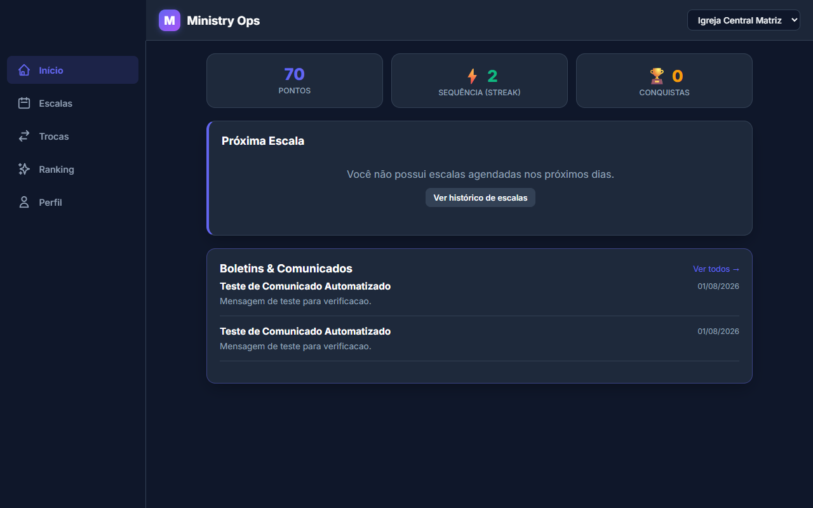
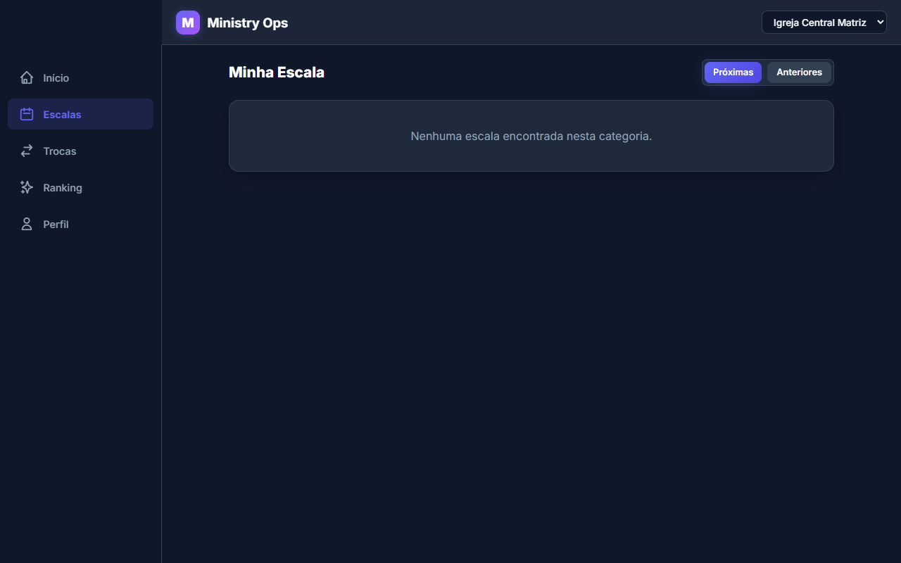
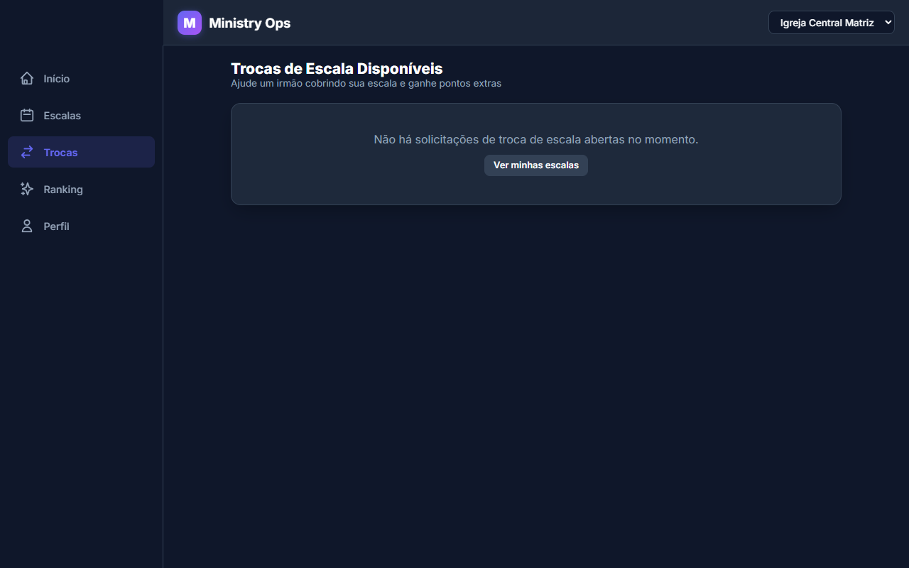
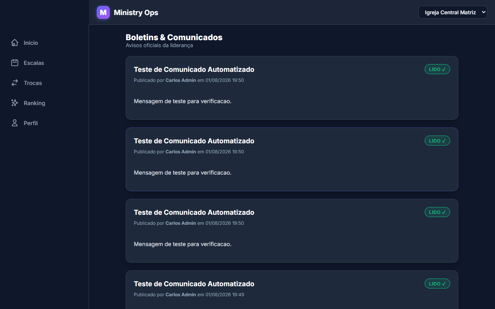
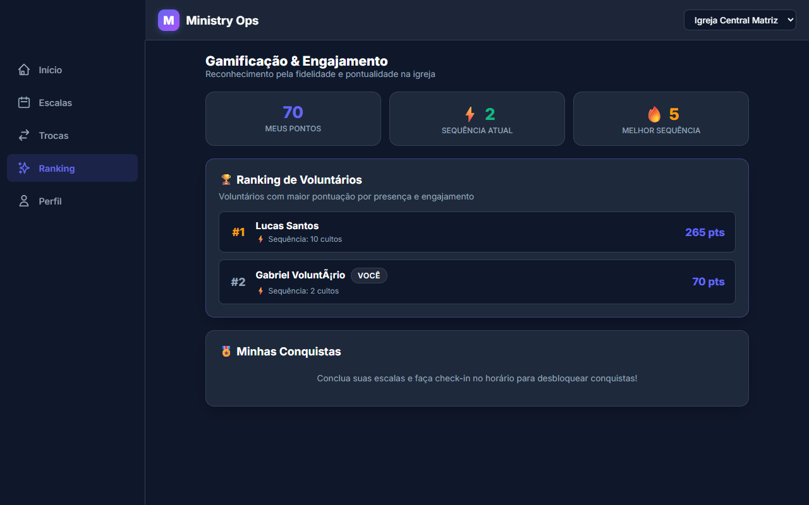
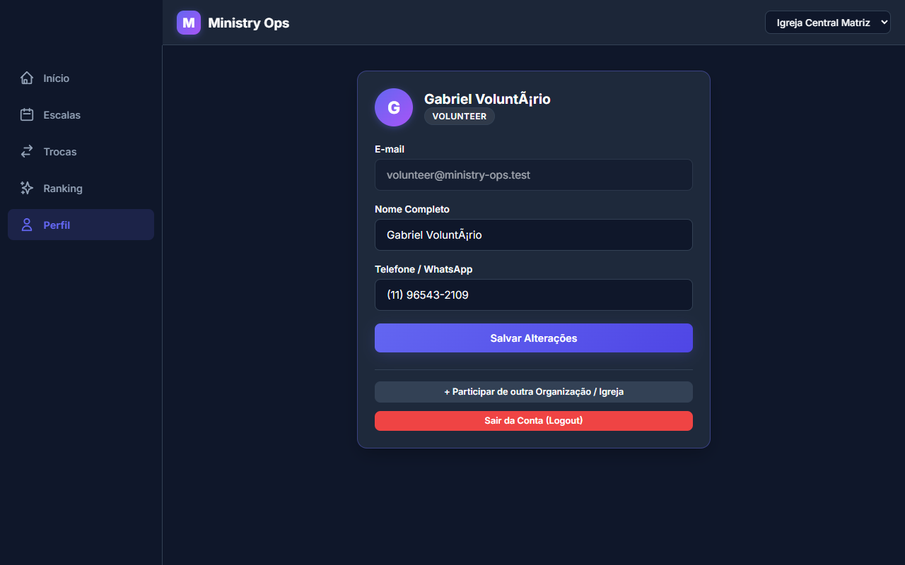

# 📱 03. Fluxos do Voluntário

Esta seção documenta a jornada do voluntário nas operações do dia a dia: visualização do Dashboard, confirmação ou recusa de escalas, solicitação e cobertura de trocas, check-in por GPS, gamificação e leitura de boletins.

---

## 📊 1. Dashboard do Voluntário

O Dashboard centraliza as informações mais importantes para o voluntário:
- Card da **Próxima Escala** com botão rápido para confirmação.
- Nível de Gamificação, Pontuação total e Sequência (Streak).
- Feed de **Avisos e Boletins Recentes**.

---

## 📅 2. Minha Escala (Gestão de Presença)

Ao acessar o menu **Minha Escala**, o voluntário visualiza suas atribuições ordenadas por data e hora.

### 🟢 Happy Path: Confirmar Presença Antecipada
1. O voluntário clica no botão **Confirmar Presença**.
2. Opcionalmente digita uma observação ou comentário para o líder.
3. O sistema valida a confirmação e concede pontos de pontualidade.

> **Mensagem do Sistema**: `Escala confirmada com sucesso! Você ganhou pontos de presença.`

---

## 🔄 3. Troca de Escalas (Swaps)

Caso o voluntário tenha um imprevisto, ele pode solicitar uma troca pública para que outros voluntários da igreja se candidatem para cobrir.

### 🟢 Happy Path: Publicar Solicitação de Troca
1. O voluntário seleciona a escala e informa o motivo da ausência.
2. Clica em **Publicar Solicitação de Troca**.

> **Mensagem do Sistema**: `Solicitação de troca publicada! Outros voluntários da sua igreja poderão se candidatar.`

---

## 📍 4. Check-in por Geolocalização (GPS)

No dia do evento/culto, o voluntário realiza o check-in presencial utilizando a localização do seu dispositivo.

### 🚨 Exceção 4.1: Check-in Fora do Raio Permitido
Caso o voluntário tente fazer check-in longe do local do culto (fora do raio estipulado, ex: > 200m):

> **Mensagem do Sistema**: `Você está fora do raio permitido para realizar o check-in (Distância: X metros, Máximo: Y metros).`

### 🟢 Happy Path: Check-in Valido / Liberação de Exceção pelo Líder
Quando o voluntário está no local ou o líder autorizou o bypass de geolocalização:

> **Mensagem do Sistema**: `Check-in realizado com sucesso! Presença confirmada no culto.`

---

## 📢 5. Boletins e Comunicados

Os voluntários podem visualizar o feed de anúncios publicados pela liderança e marcar como lido.

---

## 🏆 6. Gamificação e Ranking (Leaderboard)

A aba de **Gamificação** exibe o nível atual do voluntário, badges/conquistas desbloqueadas e a classificação geral da igreja.

---

## 👤 7. Perfil do Voluntário

Permite a atualização de dados cadastrais, e-mail e telefone de contato.

### 🚨 Exceção 7.1: Tentativa de Acesso sem Permissão Admin
Caso um voluntário tente acessar rotas restritas de administração (ex: `/admin/dashboard`):

> **Resultado Esperado**: O sistema bloqueia o acesso e exibe a mensagem: `Acesso negado. Apenas administradores e líderes podem acessar este painel.`
