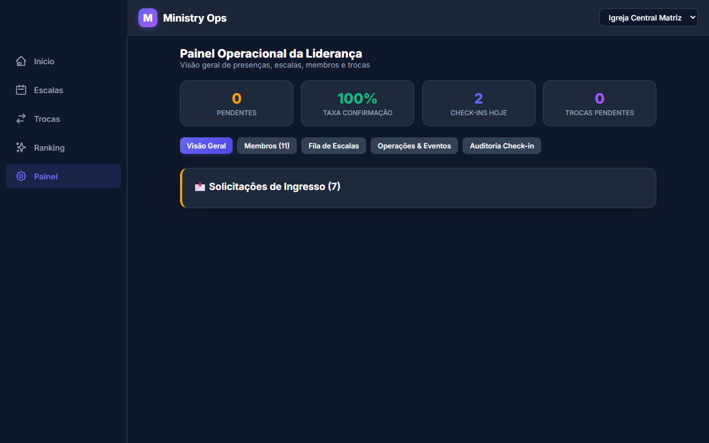
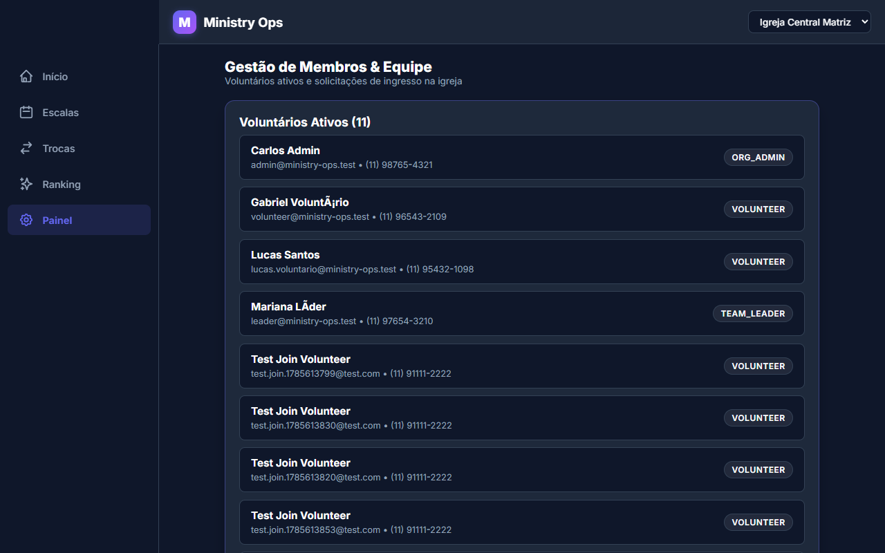
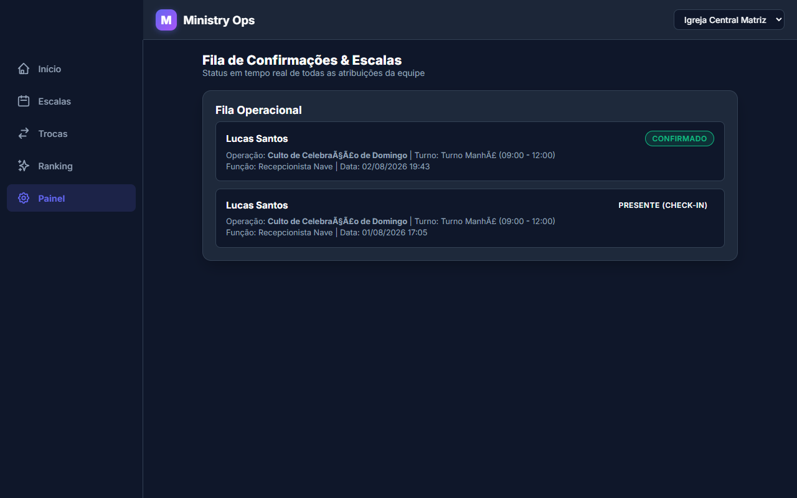
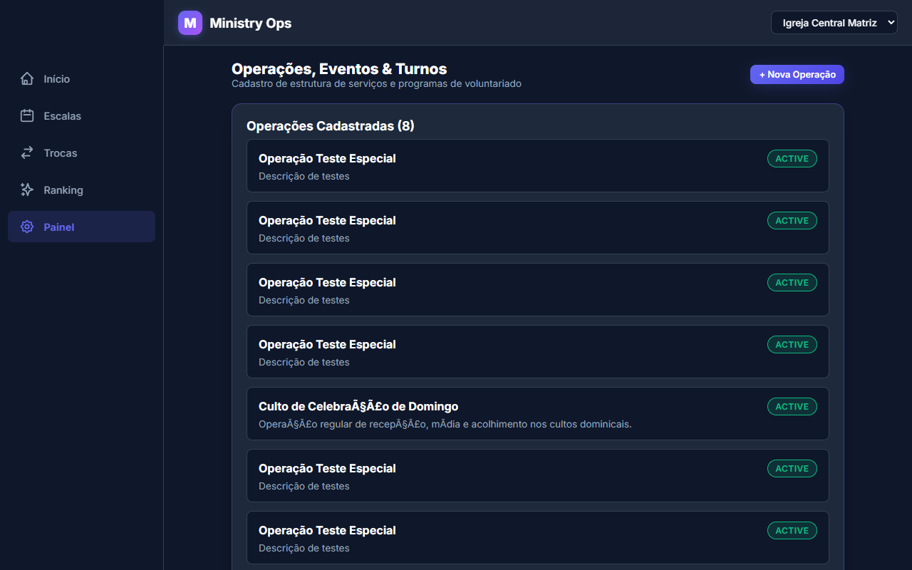
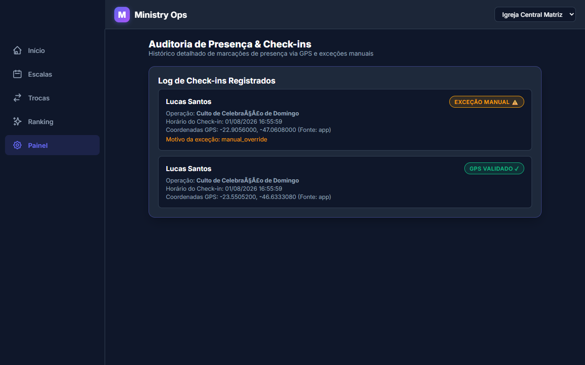

# 👑 04. Fluxos do Administrador e Líder

O **Painel Administrativo** é o centro de controle para líderes de ministério e administradores da igreja gerenciarem membros, solicitações de troca, eventos, turnos, escalas e presença.

---

## 📊 1. Painel de Controle (Admin Dashboard)

O Dashboard do Administrador apresenta métricas essenciais em tempo real:
- Taxa de confirmação geral de escalas.
- Total de check-ins realizados no dia.
- Solicitações pendentes de ingresso e trocas de escala aguardando aprovação.

---

## 👥 2. Gestão de Membros e Aprovação de Ingressos

Nesta tela, o líder visualiza todos os voluntários cadastrados na organização e analisa as solicitações de novos membros.

### 🟢 Happy Path: Aprovação de Membro
1. O líder identifica o voluntário na lista de **Solicitações Pendentes**.
2. Clica no botão **Aprovar**.
3. O voluntário passa a integrar a igreja e pode ser escalado nos eventos.

> **Mensagem do Sistema**: `Solicitação de ingresso aprovada com sucesso.`

---

## 📋 3. Fila de Confirmações e Aprovação de Trocas

Nesta aba, o líder acompanha o status de todas as escalas da igreja (Confirmadas, Pendentes, Recusadas) e aprova substituições de trocas de voluntários.

### 🟢 Happy Path: Aprovação de Troca de Escala
1. O líder visualiza uma solicitação onde outro voluntário se ofereceu para cobrir a escala.
2. Clica em **Aprovar Troca**.
3. O sistema atualiza o voluntário responsável na escala e notifica ambos.

> **Mensagem do Sistema**: `Troca de escala aprovada e voluntário reatribuído com sucesso!`

---

## ⚙️ 4. Gestão de Operações, Eventos, Turnos e Escalação

O módulo de **Operações** permite estruturar o calendário da igreja:
- **Operação**: ex: Culto de Domingo, Culto de Jovens, Conferência.
- **Instância de Evento**: ex: Culto das 19h no dia 10/10.
- **Turnos (Shifts)**: ex: Turno da Manhã, Turno da Noite.
- **Escalação de Voluntário**: Atribuição formal de um membro a um turno/função.

---

## 📜 5. Registro Auditado de Presença (Attendance Audit Logs)

O líder pode consultar o histórico detalhado de check-ins presenciais efetuados pelos voluntários, incluindo horário exato, coordenadas de GPS e se houve bypass manual concedido.

