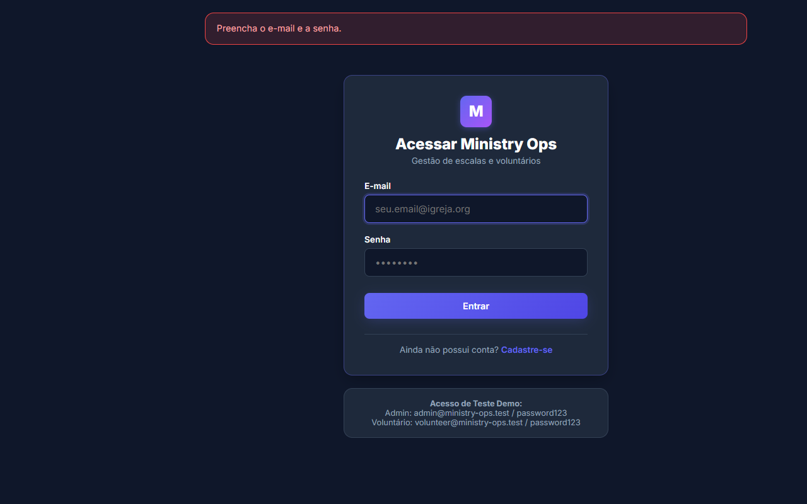
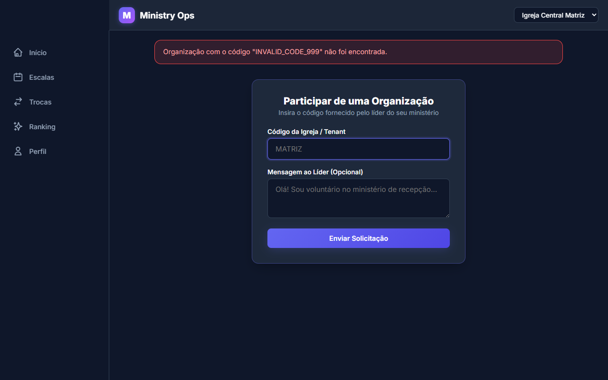
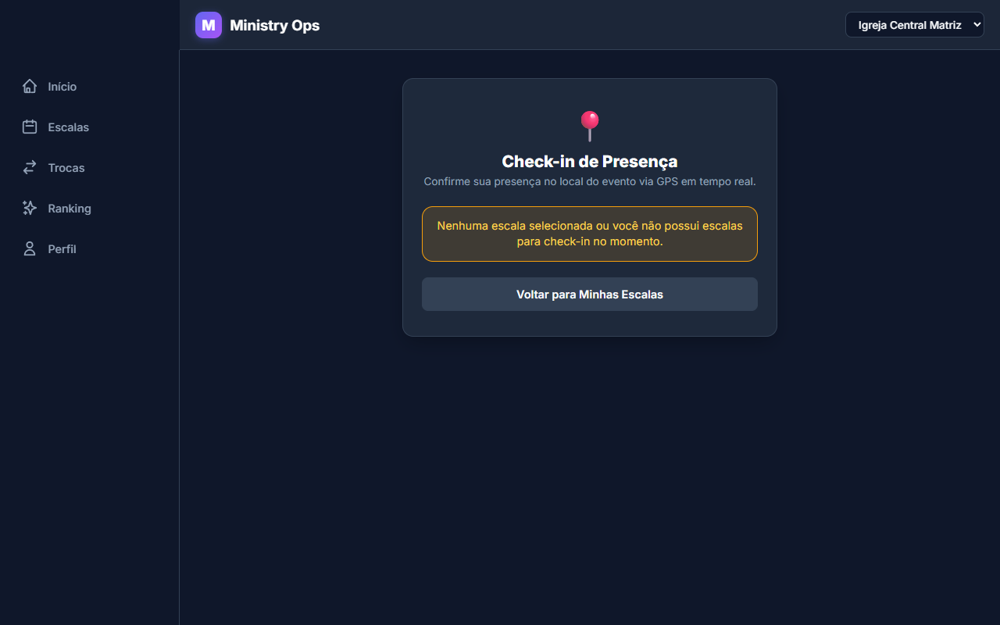
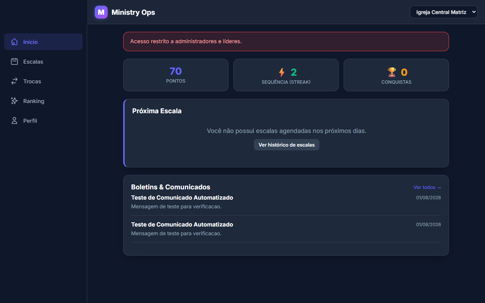

# ⚠️ 05. Matriz de Exceções e Resolução de Problemas

Esta seção serve como guia de referência rápida para solucionar mensagens de alerta, falhas operacionais e comportamentos de exceção no **Ministry Ops**.

---

## 📑 Matriz Sintética de Exceções

| Módulo | Tipo de Exceção | Screenshot de Referência | Mensagem do Sistema / Sintoma | Causa Raiz | Ação Recomendada para o Usuário |
|---|---|---|---|---|---|
| **Autenticação** | Credenciais Inválidas |  | `E-mail ou senha incorretos.` | E-mail não cadastrado ou senha digitada incorretamente. | Verificar grafia do e-mail e senha. Solicitar redefinição ao administrador se necessário. |
| **Autenticação** | Campos Obrigatórios Vazio |  | `Preencha o e-mail e a senha.` | Tentativa de submissão do formulário com campos em branco. | Preencher todos os campos destacados em vermelho antes de enviar. |
| **Cadastro** | E-mail Duplicado |  | `Este e-mail já está cadastrado.` | O e-mail informado já possui uma conta no sistema. | Fazer login com a conta existente ou utilizar a recuperação de senha. |
| **Organização** | Código Inexistente |  | `Organização com o código "..." não foi encontrada.` | O código alfanumérico digitado não corresponde a nenhuma igreja cadastrada. | Confirmar o código oficial com a liderança da igreja (ex: `MATRIZ`). |
| **Check-in GPS** | Fora do Raio de Geolocalização |  | `Você está fora do raio permitido para realizar o check-in.` | O GPS do smartphone reportou coordenadas fora do perímetro configurado para o culto. | Aproximar-se do local do culto, ativar o GPS de alta precisão do celular ou solicitar bypass manual ao líder. |
| **Segurança** | Acesso Não Autorizado |  | `Acesso negado.` | Um voluntário tentou acessar a URL do Painel Admin diretamente. | O acesso admin é restrito a líderes e organizadores. Voltar ao Dashboard principal. |

---

## 🔍 Checklist de Diagnóstico para o Usuário Final

### 1. O GPS do meu celular não funciona no Check-in:
- **Passo 1**: Verifique se a localização (GPS) do smartphone está ativada.
- **Passo 2**: Permita o acesso à localização quando solicitado pelo navegador da web.
- **Passo 3**: Em ambientes fechados ou de fraca recepção GPS, aguarde alguns segundos até o navegador fixar as coordenadas ou contate seu Líder de Equipe para autorização manual.

### 2. Não vejo minha escala no Dashboard:
- **Passo 1**: Confirme se você está conectado na organização correta (seção de alternar igreja no menu superior/lateral).
- **Passo 2**: Verifique se sua solicitação de ingresso na igreja já foi aprovada pelo administrador (Menu -> Membros).
